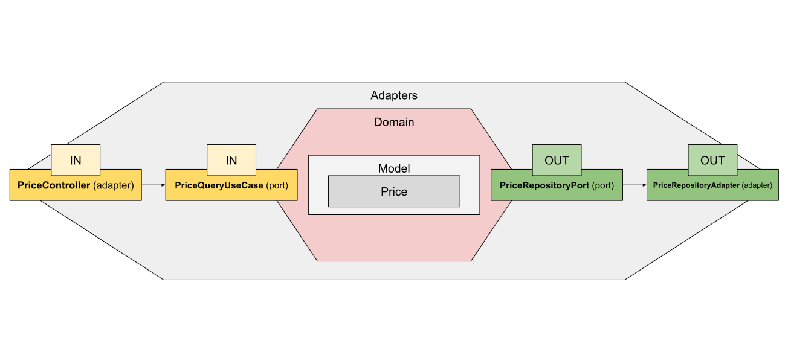

# ecommerce service
by _Alan Viera_

This project is a Spring Boot application that implements a product pricing API using **Hexagonal Architecture (Ports & Adapters)**. It exposes a REST endpoint for querying the price of a product at a specific date and brand context.

---

## 1. Architecture: Hexagonal (Ports & Adapters)



Most relevant packages include:
- **domain:** Core business logic (Model, UseCases, Ports)
- **application:** UseCase Implementations (e.g. PriceQueryUseCaseImpl)
- **adapter:**
  - **in/rest:** REST Controllers (e.g. PriceController)
  - **out/persistence:** JPA Repositories & DB Adapters
- **test:**
  - **adapter/in/rest:** unit test for **PriceController** class
  - **adapter/out/persistence:** unit test for **PriceRepositoryAdapter** class
  - **application/service:** unit test for **PriceQueryUseCaseImpl** class
  - **integration:** integration test to validate the 5 tests cases from the challenge

The project also includes:
- **resources:** _application.yml_ "base" Spring profile configuration
- **resources/db:**
  - **data:** _real_data_prices.csv_ and _test_data_prices.csv_ for Flyway initial CSV load
  - **migration:** Flyway migrations (schema creation and load)
- **test/resources:** _application-test.yml_ "test" Spring profile configuration

## 2. Features

- Query the price of a product based on:
  - **application date**
  - **product ID**
  - **brand ID**
- Follows **Hexagonal Architecture** using Ports & Adapters
- Java 21 + Gradle
- Spring Boot Framework 3.5.4
  - spring-boot-starter-web: Spring MVC
  - spring-boot-starter-data-jpa: Spring Data JPA
  - spring-boot-starter-test: JUnit, Mockito, and AssertJ for testing
- Jakarta + Hibernate Validator for input validation
- Lombok for boilerplate code by auto-generating getters, setters, constructors, etc.
- h2database:h2 for in-memory database
- OpenAPI 3 (Swagger) for documentation for REST endpoints
- Uses **Flyway** and **CSV data** for test + dev environments
- **Integration tested** using `@SpringBootTest` and `MockMvc`

## 3. Key Classes

- `PriceController` (adapter-in)
- `PriceQueryUseCase` & `PriceQueryUseCaseImpl` (domain port & application service)
- `PriceRepositoryPort` & `PriceRepositoryAdapter` (adapter-out)

## 4. Database and Test Data

- Uses H2 (in-memory) both "test" and "default" profiles.
- Database tables and seed data loaded using Flyway:

resources/db/
- migration/V1__init_schema.sql
- data/real_data_prices.csv
- data/test_data_prices.csv

## 5. Testing

- All tests are under **src/test**:
  - **adapter/in/rest:** unit test for **PriceController** class
  - **adapter/out/persistence:** unit test for **PriceRepositoryAdapter** class
  - **application/service:** unit test for **PriceQueryUseCaseImpl** class
  - **integration:** integration test to validate the 5 tests cases from the challenge

## 6. Run the App

Build:
`./gradlew clean build`

Start with default profile:
`./gradlew bootRun --args='--spring.profiles.active=default'`

Run only the integration tests (test cases from the challenge):
`./gradlew test --tests com.alanviera.ecommerce.integration.PriceControllerIntegrationTest`

Run all tests:
`./gradlew test`

Access OpenAPI 3 (Swagger) documentation:
http://localhost:8080/swagger-ui/index.html

## 7. Sample request

Request:
```
GET /price?date=2020-06-14T21%3A00%3A00&productId=35455&brandId=1
```

Response:
```
{
    "productId": 35455,
    "brandId": 1,
    "priceListId": 1,
    "startDate": "2020-06-14T00:00:00",
    "endDate": "2020-12-31T23:59:59",
    "price": 35.50,
    "currency": "EUR"
}
```
